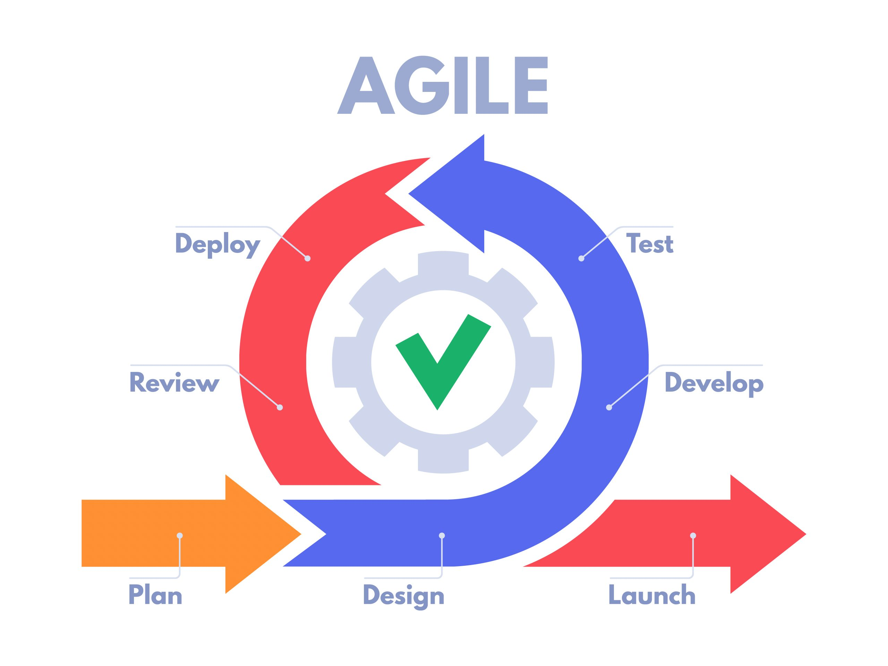

## My Thoughts on SWE (Software Engineering)
Over the past year or so, there seems to be trend of making of fun of those who are currently studying software engineering. This is due to the fact of major companies laying off a lot of their employees, so those that graduate won't find a job due to the market of hiring software engineers. Now this topic scares a lot of people and it scares me too, but it isn't something that we can control. If you really want to study software engineering, but are too afraid of the fact that you won't find a job or make good money. Then this isn't the field for you. I wanted to go into this field because I enjoyed learning about computers and makes one work. Even if I can't find a job after I graduate I will have no regrets taking this major as I've enjoyed every part of the journey so far. 

## Agile Project Management

Agile Project Management is something that I'll be using for the rest of my career, and I'm glad I've learned it now while taking this course in software engineering. The agile project management methodology places a strong emphasis on adaptability, teamwork, and ongoing development. It was first used in the software development sector, but because of how well it handled complicated projects with fast changes, it has subsequently spread to other industries. Agile Project management is a continuous cycle of design, develop, test, deploy, anf review. I was able to receive first-hand experience because of SWE, and even if I decide to not follow the path of being a software developer this is a skill I find very useful as working in a team setting is something I am guaranteed to be doing in the future.

## Ethics in SWE

The moral principles and standards that direct software engineers' and developers' conduct in their line of work are referred to as ethics in software engineering. It involves providing the well-being of all stakeholders top priority when making decisions and taking into account how software is developed and used in relation to people, society, and the environment. I feel that these moral principles and standards shouldn't be only for SWE for all engineering in general. Generally, the jobs of engineers are to innovate and design the world to become a better place. Heading into the ending of this software engineering class, I've learned that I would like continue and help create projects and applications that can help an everyday person. Though I can see how one can fall off this path in favor of money. Similar to what I said earlier, don't go into SWE if you're only in it for the money. There are many fields in Computer Science that could be better for you.

###### chatGPT was used to help understand the two topics