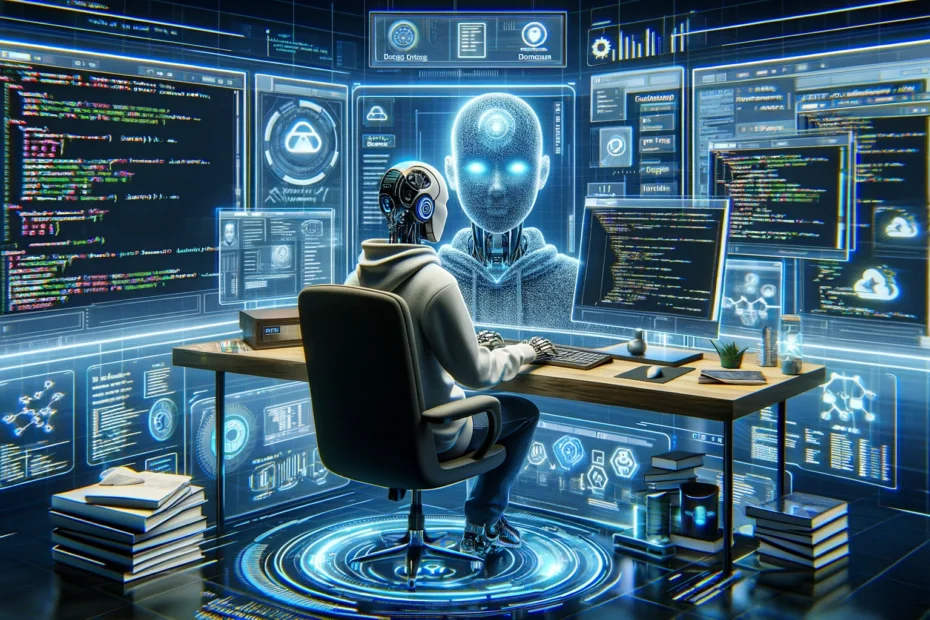

### I. Introduction
The role of AI in education for Software Engineering has made an impact with quick answers for basically any problem you ask it. I have used AI specifically ChatGPT to come up with writing prompts to ensure that my writings have good structure to meet the requirements of a basic college essay. Even though we have writing prompts in ICS 314, I have not used AI to help me write since the writing is freer.

### II. Personal Experience with AI:
I have used AI in class this semester in the following areas:

1. Experience WODs e.g. E18:

The experience WODs has been a hit or miss for me. I would either understand the experience very easily or not understand it at all and rely on watching the demonstrations to see what I'm supposed to be doing. In some cases where I wanted to try to do the experience without the demo, I would try to get suggestions from chatGPT.

2. In-class Practice WODs

When it comes to the in-class practice WODs I think I only used chatGPT once, and this was during the time we were given to display a history of surfing. I felt like using chatGPT because I wanted to have something posted in the discord channel as that was a requirement of the assignment. My main goal was to just display something and chatGPT didn't help with solving my issue at the time, but it helped narrow it down.

3. In-class WODs

The first ever WOD we had in class I failed, I failed because of a simple syntax error. I had completed every other part of the WOD but just
figured this error out. I knew we could use AI like chatGPT, but it felt like I was cheating myself. As we went through more WODs I accepted that using
chatGPT is okay because it takes care of finding the tiny mistakes that could cost you 10-20 minutes in just seconds, and with the time limit of the WODs
every second or minute counts as it's pass or fail.

4. Essays

Going into ICS 314 I didn't expect to be writing anything since it can be bothering some sometimes to write a reflection, but when looking back it's nice or funny to see your thought process at the moment. The prompts were fun to write about and helped make the essay feel like less of a chore. So using AI didn't really come to mind in completing the essays.

5. Final project

With my part in the final project, I have used chatGPT to help come up with a solution to filter each item by its category in the lost/found item pages. Now when chatGPT first gave its solution it didn't work because of syntax errors like using the wrong parameters, so it took maybe 5-10 to fix the errors and after that everything was good.

6. Learning a concept / tutorial

I haven't used AI to learn a specific topic in 314, but if I needed help I would just use chatGPT to fix to issue. So I would use it as a last-minute solution if I couldn't come up with anything else.

7. Answering a question in class or in Discord

It never came to mind to answer a peer's question using AI. It doesn't make sense to go out of your way to help them to then just rely on chatGPT as an answer for them. They  very could've just done that as well before asking their question.

8. Asking or answering a smart-question

I haven't tried asking SMART questions in Discord due to the fact that I am afraid of asking for help in a big channel of people I don't really know. If I really had to ask a SMART I think i will use chatGPT just to be sure that it is a SMART question because I've seen other students get called out for not doing it properly.

9. Coding example e.g. “give an example of using Underscore .pluck”

I think when it comes to solving coding issues, I don't typically ask for examples when using AI. When I'm resolving to use AI it is typically my last resort so I ask for the direct solution to my problems.

10. Explaining code

Using AI like chatGPT to explain specific issues is something I've used a lot for other classes and ICS 314 is no exception. I have used it to explain parts of our meteor template when we were first introduced and I believe it helped. You can ask for the general idea of the file or what part of the code does what.

11. Writing code

Writing code has to be one of the biggest uses for ICS 314. To me it's a great fallback if you seem that every solution you tried is not working. ChatGPT for example, you could ask one prompt to resolve an issue, but if that won't work try another and another until you end up with some sort of solution. It can work most of the time whenever you decide to use it, but when it doesn't you still need to understand the code in order to debug whatever errors it sends out with its solution to your problem.

12. Documenting code

I don't think I've ever documented code, but I could be misinterpreting the prompt. I have written comments on code to easily reflect back what specific functions do. So when it comes to using AI to document code it has never come to find, but I can see how that can save time as it would probably give more detail than I would to specific functions.

13. Quality assurance

When it comes to quality assurance, if the project works on my end I don't typically second guess if there could be a possibility of it going wrong. I think I would prefer to manually do and see all test cases rather than rely on chatGPT to see if everything should go to plan, but now I might try and see how it could work.

14. Other uses in ICS 314 not listed above

I can't find other reasons to use AI in this, but maybe have it look over your personal portfolio. For example the resume, the resume of your portfolio can be one of the most important parts as you decide what are the most important assets you have to offer. Maybe there are other ways to describe those skills and AI can help you rewrite them to appeal more towards recruiters.

### III. Impact on Learning and Understanding:

AI has significantly improved my progress and learning in this class. It has saved me a lot of time and frustration when it comes to debugging code and advice on where to start looking for solutions. AI will be here to stay as it is a tool for software engineering like how a calculator is to mathematicians.

### IV. Practical Applications:

I can see AI being used to create modern coding projects today. A few months ago I saw someone use chatGPT to come up with a code for a camera to identify if a parking spot was taken outside of an apartment. Now chatGPT didn't write the entire code to make the application work, but it played a part in making it work. It seemed like the user had the capabilities to write the code themself, but decided to try and save time by having chatGPT do it for them.

### V. Challenges and Opportunities:

It seems to me that the only challenge when it comes to AI is whether or not your explanation is clear enough for whatever AI you are using. Sometimes I would have to write "No that's not what I meant this is ..." I can see AI making those in software engineering more "lazy", but if those who use it still have good intentions in learning how to code or solve problems then I see no problem for further integration of AI in software engineering.

### VI. Comparative Analysis:

I still believe traditional teaching methods will be better for education in software engineering compared to a more AI-enhanced approach. If teachers do decide to go more towards an AI-enhanced approach students could feel a lack of importance from the teachers and question why they're even here to teach in the first place.

### VII. Future Considerations:

AI in the next 2-3 could look completely different than how we see it today. As we know it has grown exponentially, so to see where this will lead future software engineering courses will be hard to predict, but if I were to just guess. It would be that we will see less of those exceeding because of their talent in coding and more of those who can better utilize AI to save as much time as possible.

### VIII. Conclusion:

I still see software engineering as a great career to take no matter where you decide to learn from. AI applications will still be tools for software engineers to use like how a calculator is to a mathematician. I think it's better we embrace that AI has been so accessible to everyday people and we must learn how we can use this to create a better future not just for software engineers but for everyone else too.

